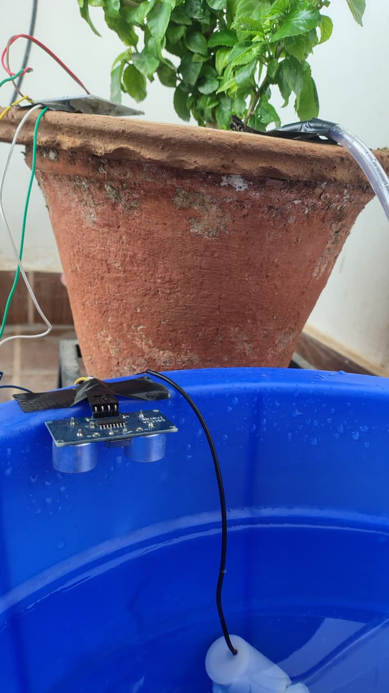
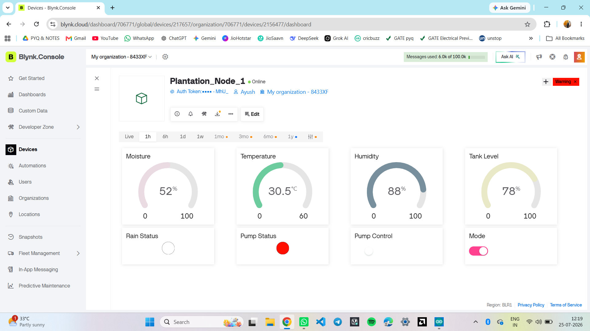
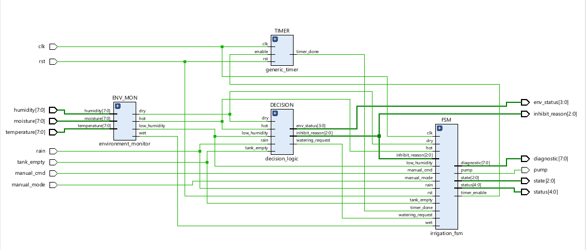
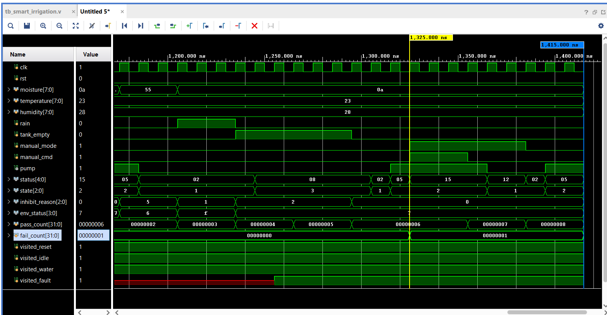

# 🌱 Smart Irrigation System


> Hardware–Software Co-Design of a Smart Irrigation Controller using **ESP32**, **Blynk IoT**, and **Synthesizable Verilog RTL**

---

## 📌 Project Overview

Efficient water management is one of the major challenges in modern agriculture. This project presents a smart irrigation controller capable of automatically monitoring environmental conditions and controlling irrigation based on real-time sensor data.

The project follows a **hardware–software co-design methodology**.

The first implementation uses an **ESP32 microcontroller** connected to multiple sensors and the **Blynk IoT Cloud** for remote monitoring and control.

The second implementation redesigns the irrigation algorithm as a **modular RTL hardware architecture** using **Verilog HDL**, verified through simulation and synthesized in **AMD Vivado 2025.2**.

---

## ✨ Features

- 🌿 Automatic Irrigation
- 💧 Soil Moisture Monitoring
- 🌡 Temperature Monitoring
- 💨 Humidity Monitoring
- 🌧 Rain Detection
- 🚰 Water Tank Level Monitoring
- 📱 Blynk Cloud Dashboard
- 🌍 Remote Pump Control
- 🔔 Notification System
- 💻 Modular Verilog RTL Design
- 🔄 Finite State Machine Control
- ✅ Self-checking Testbench
- ⚡ FPGA-ready Architecture

---

## 📷 Project Images

### Hardware Setup




### Blynk Dashboard



### RTL Architecture



### Simulation Waveform



---

## 🏗 System Architecture

ESP32 receives data from

- Soil Moisture Sensor
- DHT11
- Rain Sensor
- Ultrasonic Sensor

↓

Decision Algorithm

↓

Relay Module

↓

Water Pump

↓

Blynk Cloud

↓

Mobile Application

---

## 💻 RTL Architecture

The complete irrigation algorithm was redesigned using synthesizable Verilog HDL.

Modules include

- Environment Monitor
- Decision Logic
- Generic Timer
- Irrigation FSM
- Top Module

---

## ⚙ Hardware Components

| Component | Quantity |
|-----------|----------|
| ESP32 DevKit | 1 |
| DHT11 | 1 |
| Soil Moisture Sensor | 1 |
| Rain Sensor | 1 |
| HC-SR04 | 1 |
| Relay Module | 1 |
| Water Pump | 1 |

---

## 📂 Repository Structure

```text
Smart-Irrigation-System
├── docs
├── esp32
├── rtl
├── simulation
├── testbench
├── hardware
├── images
└── README.md
```

---

## 🔄 RTL Modules

| Module | Function |
|---------|----------|
| environment_monitor | Sensor threshold detection |
| decision_logic | Irrigation decision generation |
| generic_timer | Watering duration control |
| irrigation_fsm | System controller |
| smart_irrigation_top | Top-level integration |

---

## 🧪 Verification

The RTL design was verified using a **self-checking Verilog testbench**.

### Test Cases

- Reset
- Dry Soil
- Watering Timer
- Rain Detection
- Tank Empty
- Recovery
- Manual Mode ON
- Manual Mode OFF

Result

```
Tests Passed : 8
Tests Failed : 0

FSM Coverage : 100%
```

---

## 📊 Synthesis Results

Tool

AMD Vivado 2025.2

Resource Utilization

| Resource | Usage |
|-----------|------|
| LUTs | 25 |
| Flip-Flops | 12 |
| I/O | 53 |

---

## 🚀 Future Work

- FPGA implementation
- ASIC implementation
- SPI Sensor Interfaces
- AXI-Lite Integration
- Machine Learning Irrigation Prediction
- Solar Powered Deployment

---

## 📄 Documentation

Complete project report available inside

```
docs/
```

---

## 👨‍💻 Author

**Ayush Tiwari**

Department of Electronics and Communication Engineering

National Institute of Technology Raipur
